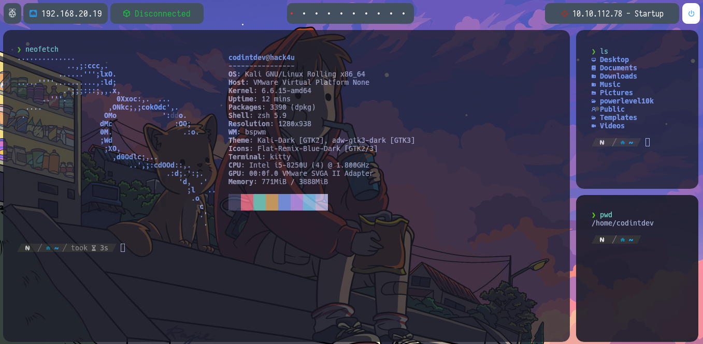

# Hello
Configuration files for the different desktop environments, personal configuration to customize terminals, environments such as qtile, bspwm, visual studio code configuration, among others.

# BSPWM

