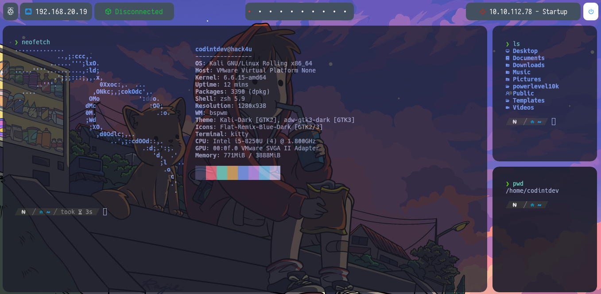
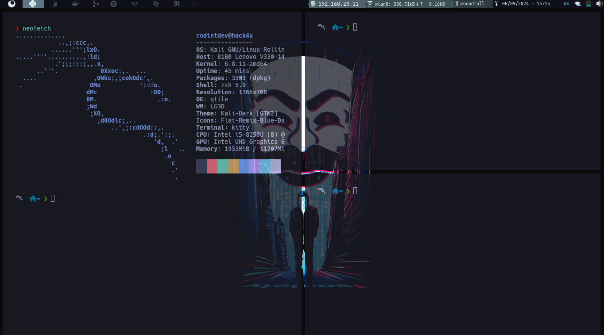

# Init
Configuration files for the different desktop environments, personal configuration to customize terminals, environments such as qtile, bspwm, visual studio code configuration, among others.

# BSPWM


# QTILE


# Configuration
## Install qtile in distribution debian
- *Install xcffib*
```bash
pip install xcffib
```
- If not install pip
```bash
apt install python3-pip
```
- *Install qtile*
```bash
pip install qtile
```
- *Config ~/.bashrc or ~/.zshrc*
```bash
nvim ~/.bashrc
    PATH="$HOME/.local/bin:$PATH"
source ~/.bashrc
```
- *Config file in xsessions*
```bash
cd /usr/share/xsessions/
cp ubuntu.desktop qtile.desktop
nvim qtile.desktop
```
- *Config file "qtile.desktop"*
```bash
[Desktop Entry]
Name=Qtile
Comment=Qtile session
Exec=/home/codintdev/.local/bin/qtile start
Type=Application
X-GDM-SessionRegisters=true
Keywords=wm;tiling
```

## Edit file "/usr/share/icons/default/index.theme"
```bash
[Icon Theme]
Inherits = Bibata-Modern-Ice
```

## Edit file "~/.config/gtk-3.0/settings.ini"
```bash
gtk-cursor-theme-name = Bibata-Modern-Ice
```
